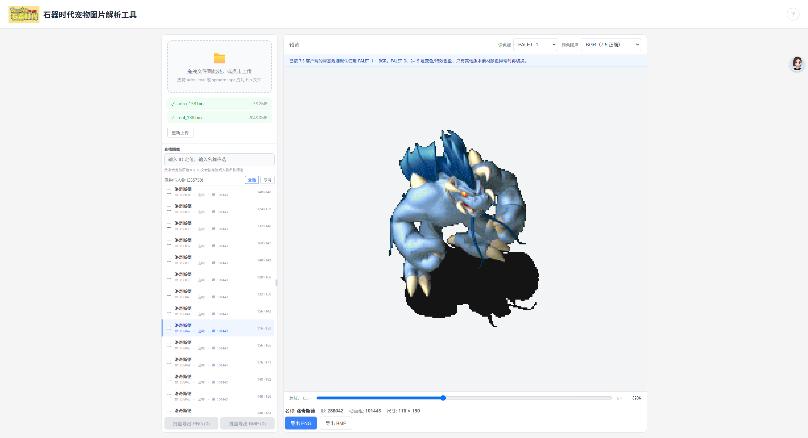
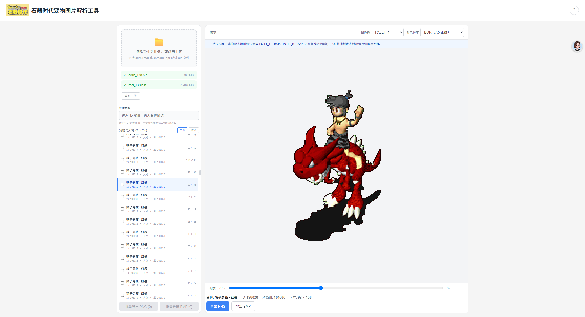
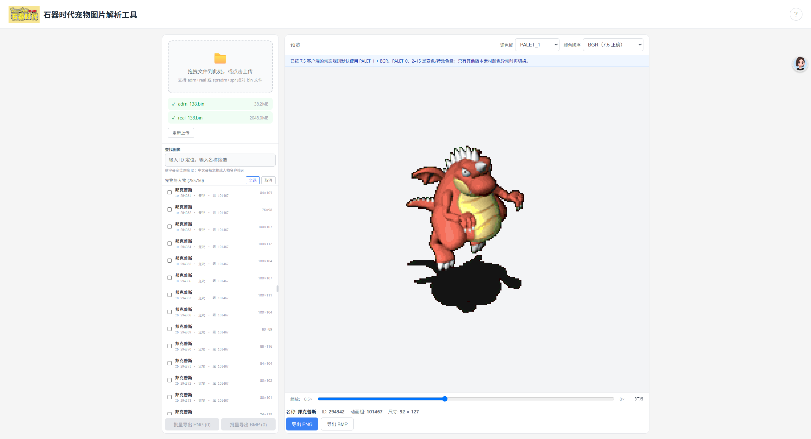

# 石器时代宠物图片解析工具

一款在浏览器中解析《石器时代》客户端图像资源的工具，针对 7.5 版本恢复宠物、人物名称及常态配色。所有文件只在本地处理，不会上传服务器。

## 主要功能

- 支持 `adrn + real` 静态图和 `spradrn + spr` 动画文件
- 从 7.5 配置恢复宠物、人物及骑乘形象名称
- 左侧仅显示可持有宠物和人物，隐藏道具、地图、特效等素材
- 支持中文名称筛选和原始图像 ID 定位
- 默认使用 `PALET_1 + BGR` 还原 7.5 常态颜色，也可切换其他色盘
- 支持缩放、上下张切换及尺寸、动画组信息查看
- 支持单张 PNG/BMP、批量 ZIP、动画 GIF 和帧序列导出
- 使用 Web Worker 和虚拟列表处理大型资源文件

## 快速开始

```bash
npm install
npm run dev
```

打开终端给出的本地地址，将成对的 BIN 文件拖入页面即可解析。生产构建使用 `npm run build`。

## 功能展示

### 宠物解析与导出



### 人物骑乘形象



### 名称检索与预览



